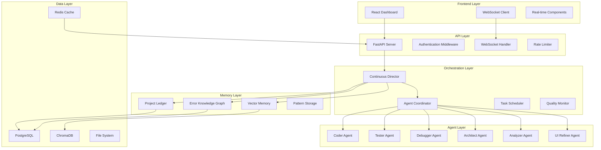
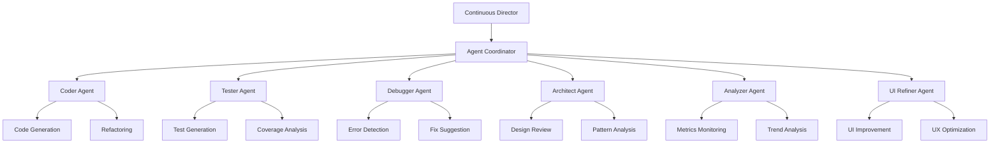
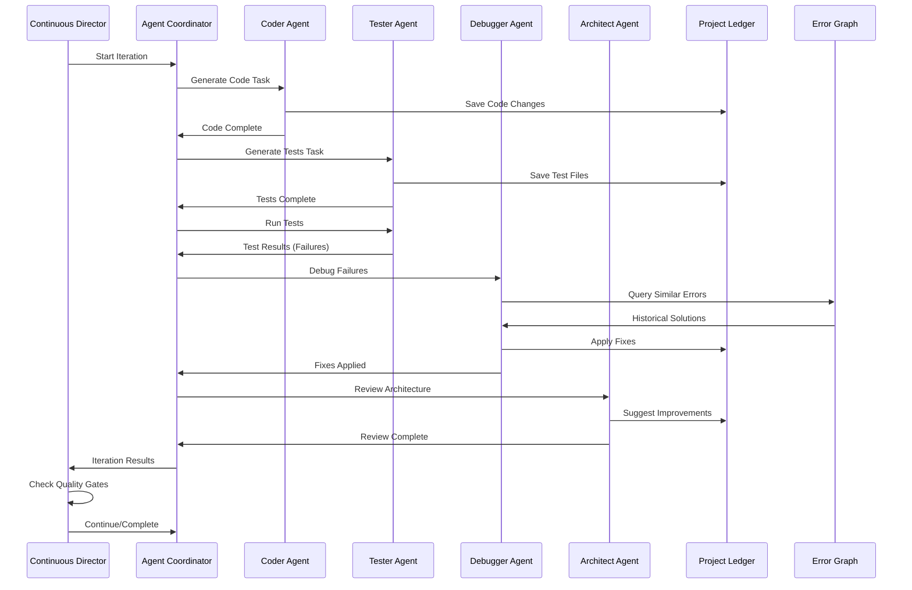
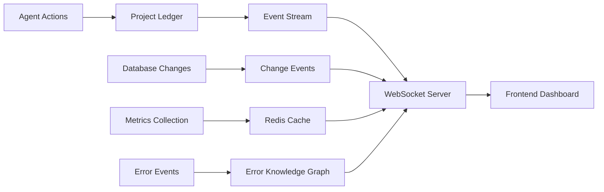
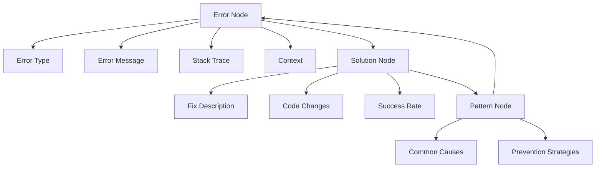
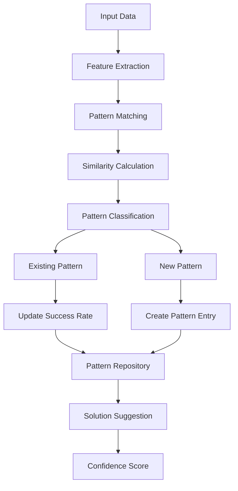
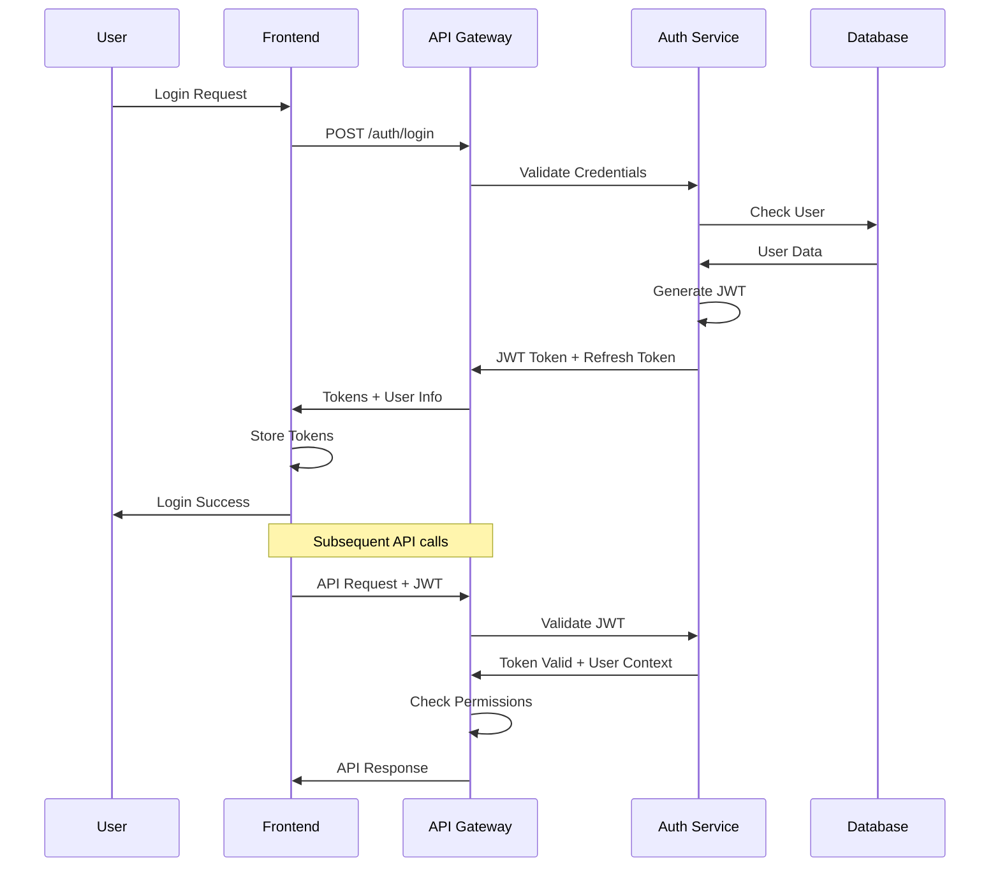
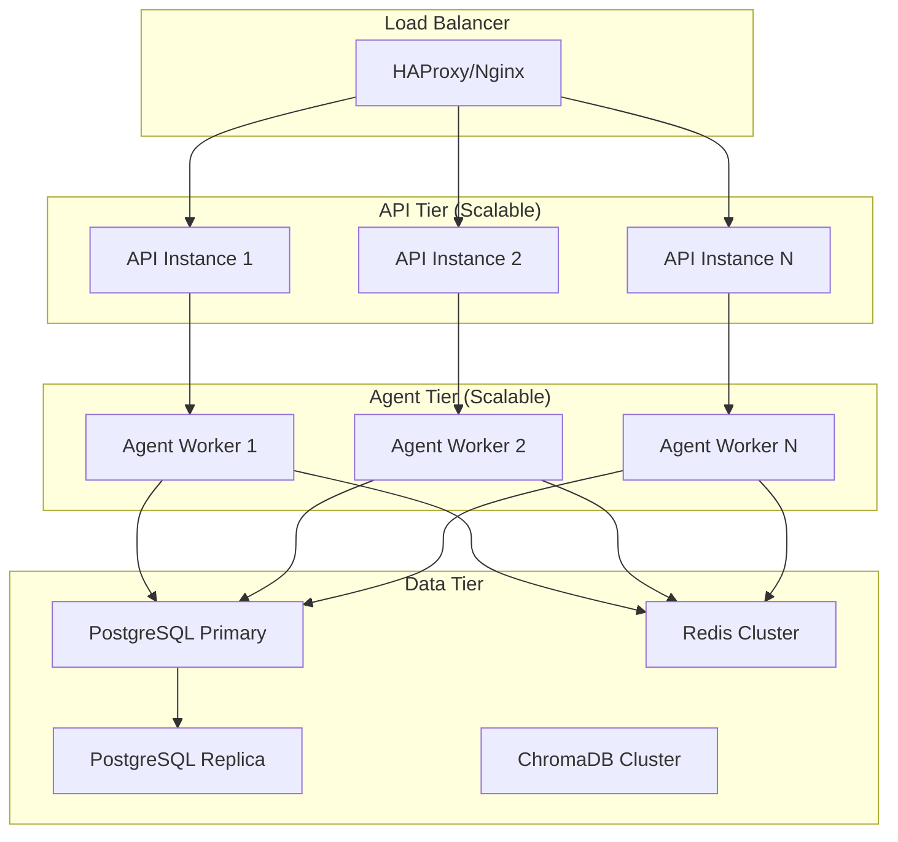
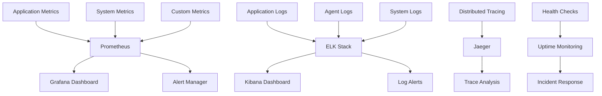

# 🏗️ MyAgent System Architecture

## 📋 Table of Contents
- [Overview](#overview)
- [System Components](#system-components)
- [Multi-Agent Architecture](#multi-agent-architecture)
- [Data Flow](#data-flow)
- [Memory Systems](#memory-systems)
- [Learning Engine](#learning-engine)
- [Security Architecture](#security-architecture)
- [Scalability Design](#scalability-design)

## 🌟 Overview

MyAgent implements a **continuous development architecture** based on the principle of never-stopping improvement. The system uses a multi-agent approach where specialized AI agents collaborate to build, test, debug, and optimize applications until they meet enterprise-grade quality standards.

### Core Design Principles
1. **Continuous Operation**: System never stops until quality goals are met
2. **Agent Specialization**: Each agent has specific expertise and capabilities
3. **Persistent Memory**: All decisions and learnings are preserved across sessions
4. **Quality-Driven**: Every action is measured against quality metrics
5. **Adaptive Learning**: System improves its performance over time

## 🏗️ System Components



## 🤖 Multi-Agent Architecture

### Agent Hierarchy and Communication



### Agent Communication Protocol

Each agent follows a standardized communication protocol:

```python
class AgentMessage:
    type: str                    # task, status, result, error
    sender: str                  # agent identifier
    recipient: str               # target agent or coordinator
    payload: Dict[str, Any]      # message content
    priority: int                # 1-10 priority level
    timestamp: datetime          # message timestamp
    correlation_id: str          # for tracking related messages
```

### Agent Capabilities Matrix

| Agent | Primary Function | Input Types | Output Types | Dependencies |
|-------|------------------|-------------|--------------|--------------|
| **Coder** | Code generation and refactoring | Requirements, existing code | Source code, documentation | LLM, Git |
| **Tester** | Test creation and execution | Source code, requirements | Test files, coverage reports | Pytest, Coverage |
| **Debugger** | Error analysis and resolution | Error logs, stack traces | Fix suggestions, patches | AST, LLM |
| **Architect** | System design and patterns | Codebase, requirements | Design documents, refactoring plans | Analysis tools |
| **Analyzer** | Metrics and performance monitoring | System metrics, logs | Reports, predictions | Monitoring tools |
| **UI Refiner** | User interface optimization | UI components, user feedback | Improved components, accessibility fixes | Design tools |

## 🔄 Data Flow

### Development Iteration Flow



### Real-time Data Synchronization



## 🧠 Memory Systems

### Project Ledger Architecture

The Project Ledger serves as the central repository for all project state and history:

```python
class ProjectLedger:
    """Central repository for project state and history"""

    def __init__(self, project_name: str):
        self.project_name = project_name
        self.db_path = f"persistence/database/{project_name}_ledger.db"
        self.current_iteration = 0
        self.milestones = []
        self.checkpoints = {}

    # Core operations
    def record_action(self, agent: str, action: str, details: Dict)
    def create_checkpoint(self) -> str
    def rollback_to_checkpoint(self, checkpoint_id: str)
    def get_project_history(self) -> List[Dict]
    def calculate_quality_score(self) -> float
```

### Error Knowledge Graph Structure



### Vector Memory for Semantic Understanding

```python
class VectorMemory:
    """Semantic memory using ChromaDB"""

    def __init__(self, project_name: str):
        self.client = chromadb.PersistentClient(
            path=f"persistence/vector_db/{project_name}"
        )
        self.collections = {
            'code': self.client.get_or_create_collection('code_snippets'),
            'errors': self.client.get_or_create_collection('error_patterns'),
            'solutions': self.client.get_or_create_collection('solutions'),
            'requirements': self.client.get_or_create_collection('requirements')
        }

    def store_code_snippet(self, code: str, metadata: Dict)
    def find_similar_code(self, query: str, n_results: int = 5)
    def store_error_pattern(self, error: str, context: Dict)
    def find_similar_errors(self, error: str, n_results: int = 3)
```

## 🎓 Learning Engine

### Pattern Recognition System



### Learning Feedback Loop

```python
class LearningEngine:
    """Continuous learning from development patterns"""

    def learn_from_success(self, context: Dict, solution: Dict, problem_type: str):
        """Learn from successful solutions"""
        # Extract patterns from successful iterations
        pattern = self.extract_pattern(context, solution)

        # Update or create pattern in knowledge base
        if self.pattern_exists(pattern):
            self.update_pattern_success_rate(pattern)
        else:
            self.create_new_pattern(pattern, problem_type)

    def learn_from_failure(self, context: Dict, error: str, attempted_solution: Dict):
        """Learn from failed attempts"""
        # Create anti-pattern to avoid similar failures
        anti_pattern = self.create_anti_pattern(context, error, attempted_solution)

        # Update error knowledge graph
        self.error_graph.add_failure_case(error, context, attempted_solution)

    def suggest_solution(self, context: Dict, problem_type: str) -> Optional[Dict]:
        """Suggest solution based on learned patterns"""
        # Find similar patterns
        patterns = self.find_matching_patterns(context, problem_type)

        # Rank by success rate and relevance
        best_pattern = self.rank_patterns(patterns)

        if best_pattern and best_pattern.confidence > self.min_confidence:
            return self.adapt_solution(best_pattern.solution, context)

        return None
```

## 🔐 Security Architecture

### Authentication & Authorization Flow



### Security Layers

1. **Network Security**
   - HTTPS/TLS encryption
   - Rate limiting per IP/user
   - CORS configuration
   - Request validation

2. **Authentication Security**
   - JWT with short expiration
   - Refresh token rotation
   - Session management
   - Password hashing (bcrypt)

3. **Authorization Security**
   - Role-based access control (RBAC)
   - Resource-level permissions
   - API key authentication for agents
   - Audit logging

4. **Data Security**
   - Database encryption at rest
   - Redis encryption
   - Secure secret management
   - Input sanitization

### Permission Matrix

| Role | Projects | Agents | System | Admin |
|------|----------|--------|--------|-------|
| **Viewer** | Read | Read | - | - |
| **User** | CRUD | Read | - | - |
| **Agent** | Execute | CRUD | Read | - |
| **Admin** | Full | Full | Full | Full |

## 📈 Scalability Design

### Horizontal Scaling Strategy



### Performance Optimization

1. **Database Optimization**
   - Connection pooling
   - Query optimization
   - Indexing strategy
   - Partitioning large tables

2. **Caching Strategy**
   - Redis for session data
   - Query result caching
   - Static asset caching
   - CDN integration

3. **Agent Optimization**
   - Parallel agent execution
   - Task queue management
   - Resource allocation
   - Memory management

4. **Frontend Optimization**
   - Code splitting
   - Lazy loading
   - Service workers
   - WebSocket optimization

### Monitoring and Observability



## 🚀 Deployment Architecture

### Development Environment
```yaml
version: '3.8'
services:
  api:
    build: .
    environment:
      - DEV_MODE=true
    volumes:
      - ./:/app
    ports:
      - "8000:8000"

  frontend:
    build: ./frontend
    ports:
      - "3000:3000"
    volumes:
      - ./frontend:/app

  postgres:
    image: postgres:14
    environment:
      POSTGRES_DB: myagent_dev
    volumes:
      - postgres_data:/var/lib/postgresql/data

  redis:
    image: redis:7-alpine
    ports:
      - "6379:6379"
```

### Production Environment
```yaml
version: '3.8'
services:
  nginx:
    image: nginx:alpine
    ports:
      - "80:80"
      - "443:443"
    volumes:
      - ./nginx.conf:/etc/nginx/nginx.conf

  api:
    image: myagent:latest
    replicas: 3
    environment:
      - NODE_ENV=production
    secrets:
      - db_password
      - jwt_secret

  agent-workers:
    image: myagent-agents:latest
    replicas: 6
    deploy:
      resources:
        limits:
          memory: 2G
          cpus: '1'

  postgres:
    image: postgres:14
    environment:
      POSTGRES_DB: myagent_prod
    volumes:
      - postgres_prod:/var/lib/postgresql/data
    deploy:
      resources:
        limits:
          memory: 4G
          cpus: '2'

  redis:
    image: redis:7-alpine
    command: redis-server --appendonly yes
    volumes:
      - redis_prod:/data
```

## 🔄 Continuous Integration/Deployment

### CI/CD Pipeline
```yaml
# .github/workflows/ci-cd.yml
name: MyAgent CI/CD

on:
  push:
    branches: [main, develop]
  pull_request:
    branches: [main]

jobs:
  test:
    runs-on: ubuntu-latest
    steps:
      - uses: actions/checkout@v3
      - name: Setup Python
        uses: actions/setup-python@v4
        with:
          python-version: '3.11'
      - name: Install dependencies
        run: |
          pip install -r requirements.txt
      - name: Run tests
        run: |
          pytest tests/ --cov=core --cov-report=xml
      - name: Upload coverage
        uses: codecov/codecov-action@v3

  deploy:
    needs: test
    runs-on: ubuntu-latest
    if: github.ref == 'refs/heads/main'
    steps:
      - name: Deploy to production
        run: |
          docker-compose -f docker-compose.prod.yml up -d
```

This architecture ensures MyAgent can scale from development to enterprise production while maintaining the continuous development philosophy that drives the system to never stop improving until perfection is achieved.